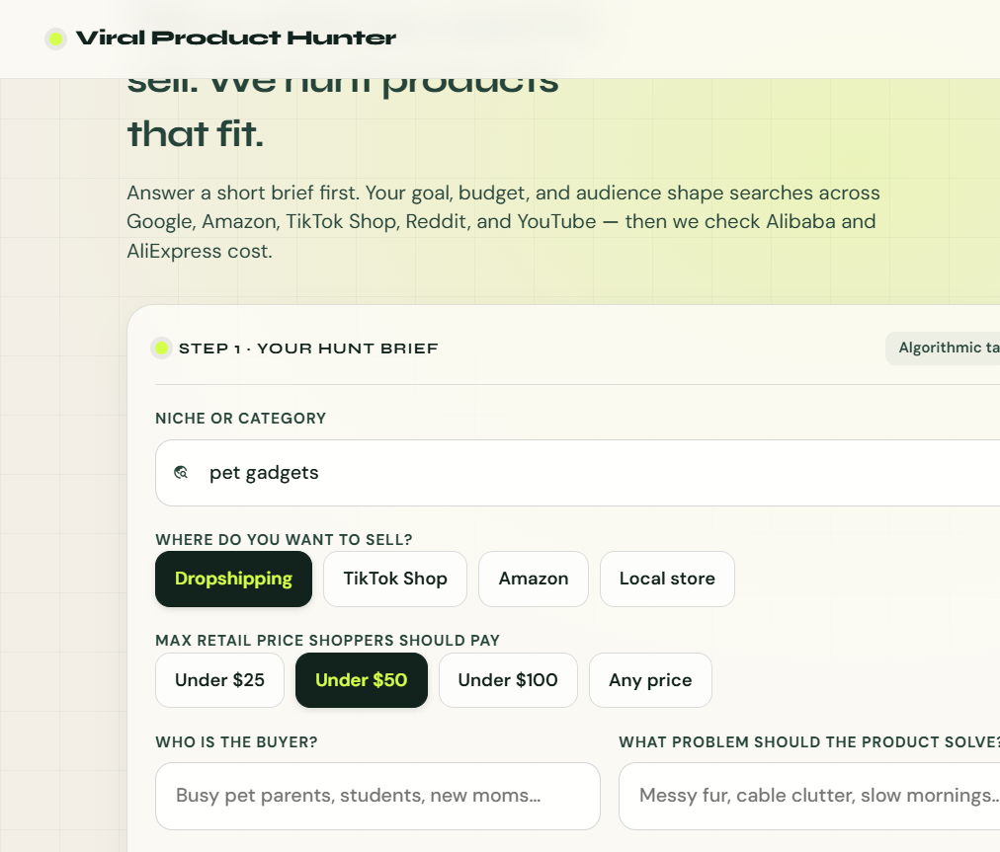

# Viral Product Hunter

Find niche products worth selling: scrape discovery sources, rank viral signal, then check Alibaba and AliExpress cost before you commit.

Stack: **FastAPI** backend + **custom web UI** (HTML/CSS/JS). No Streamlit.



Stitch design project: [Viral Product Hunter](https://stitch.withgoogle.com/projects/17360665636301376568) (Visual Hunt Studio theme).

## Layout

```text
app/
  api.py          FastAPI routes and UI hosting
  config.py       Decodo token, Kimi model, scraper limits
  decodo.py       Scraper client, parsing, and product extraction
  discovery.py    Google, Amazon, Reddit, TikTok Shop, and YouTube
  suppliers.py    Alibaba and AliExpress sourcing
  ranking.py      Kimi ranking and the deterministic fallback
  schemas.py      Request models
ui/
  index.html      Hunt form and results layout
  styles.css      Brand UI styles
  app.js          Discover/source flow and CSV export
tests/
  test_api.py
```

## Setup

Create and activate the virtual environment:

```bash
uv venv .venv
source .venv/bin/activate
```

On Windows:

```powershell
.venv\Scripts\activate
```

Install dependencies:

```bash
uv pip install -r requirements.txt
```

Copy the env template and add keys:

```bash
cp .env.example .env
```

| Variable | Required | Purpose |
| --- | --- | --- |
| `DECODO_AUTH_TOKEN` | Yes | Decodo scraper API token |
| `KIMI_API_KEY` | No | Kimi ranking. Without it, the app uses weighted scores |

Kimi uses `kimi-k3` at `https://api.moonshot.ai/v1/chat/completions`. Timeouts, worker counts, and the premium proxy pool live in `app/config.py`.

## Run

```bash
python -m app.api
```

- UI: [http://127.0.0.1:8000](http://127.0.0.1:8000)
- API docs: [http://127.0.0.1:8000/docs](http://127.0.0.1:8000/docs)

Fill the **hunt brief** first: niche, selling goal, max retail price, audience, problem to solve, preferences, and avoid list. That brief shapes discovery queries and ranking. Then click **Hunt products for my brief**. Use **Export CSV** after results load.

## Endpoints

| Method | Path | Description |
| --- | --- | --- |
| `GET` | `/` | Web UI |
| `GET` | `/health` | Health check |
| `POST` | `/discover` | Discovery + initial ranking |
| `POST` | `/source` | Supplier sourcing + final ranking |
| `POST` | `/hunt` | Full pipeline in one request |

The UI calls `/discover` and `/source` separately so it can show stage progress. `/hunt` returns `initial_products`, `final_products`, `supplier_summary`, `supplier_data`, `discovery_summary`, `discovery_data`, and `ranking_warnings`. Final ranking falls back to deterministic scores when Kimi is unavailable.

## Tests

```bash
python -m unittest -v tests.test_api
```
